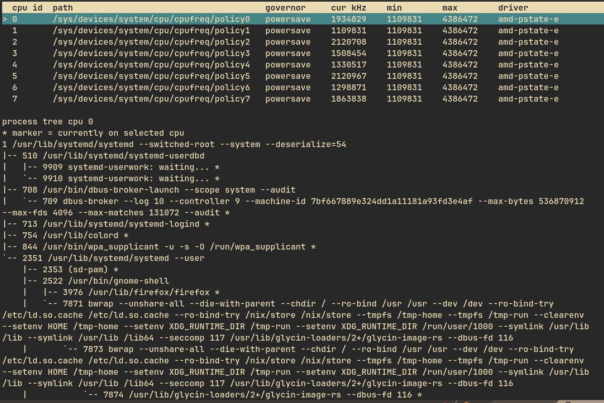

# cpumon

`cpumon` is a terminal-based CPU monitoring tool for Linux. It reads CPU governor and frequency data from `sysfs` and displays processes currently running on the selected CPU in a TUI.

## Preview



## Features

- Interactive TUI to view CPU policy data.
- Shows governor, driver, and current/min/max frequency.
- Process tree panel for the currently selected CPU.
- Auto refresh every 1 second.
- Plain text output mode via the `--read` flag.

## Requirements

- Linux
- Latest Rust toolchain (stable recommended)
- System with cpufreq support (`/sys/devices/system/cpu/cpufreq`)

## Install & Build

```bash
git clone <repo-url>
cd cpumon
cargo build --release
```

Build output binary:

- `target/release/cpumon`

## Usage

### 1. TUI (default)

```bash
cargo run -- -t
```

or simply:

```bash
cargo run --
```

### 2. Read mode (text output)

```bash
cargo run -- -r
```

### 3. App version

```bash
cargo run -- -v
```

## TUI Controls

- `j` / `Down`: move to next CPU
- `k` / `Up`: move to previous CPU
- `r`: manual refresh
- `q` / `Esc`: quit

## CLI Help

```text
A tool for manages cpu usage in Linux

Usage: cpumon [OPTIONS]

Options:
  -r, --read
  -t, --tui      interactive Terminal UI
  -v, --version  Show version
  -h, --help     Print help
```
